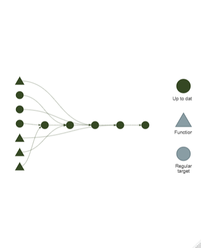

# Análisis Reproducible de RWD: Cohorte de Diabetes Tipo 2

Este proyecto demuestra la construcción de un pipeline de análisis de datos reproducible utilizando **Real World Data (RWD)** sintética (generada con Synthea). Simula el flujo de trabajo típico de un grupo de investigación epidemiológica, desde la ingesta de datos en crudo hasta la generación de un informe clínico.

## 🎯 Objetivo
Extraer una cohorte clínica de pacientes diagnosticados con Diabetes Tipo 2, vincular sus características demográficas con sus observaciones clínicas basales (HbA1c, IMC, Presión Arterial) en el momento del diagnóstico, y generar una Tabla 1 descriptiva.

## 🛠️ Herramientas y Metodología
- **Lenguaje:** R
- **Orquestación:** Paquete `targets` (pipeline dirigido por datos).
- **Gestión de Entornos:** `renv` para garantizar la reproducibilidad estricta.
- **Análisis Estadístico:** `gtsummary` para tablas de grado publicación médica.
- **Reporte:** R Markdown para informes automáticos.

## 📊 Arquitectura del Pipeline
El flujo de trabajo está completamente automatizado y modularizado. Si los datos cambian, solo se recalculan los nodos afectados.

## 🚀 Cómo reproducir este proyecto
Por motivos de privacidad/buenas prácticas, los datos crudos (`data/raw/`) no se incluyen en el repositorio. Para ejecutarlo:

1. Clona este repositorio.
2. Restaura el entorno ejecutando: `renv::restore()`
3. Añade los archivos de Synthea en `data/raw/`.
4. Ejecuta el pipeline: `targets::tar_make(callr_function = NULL)`